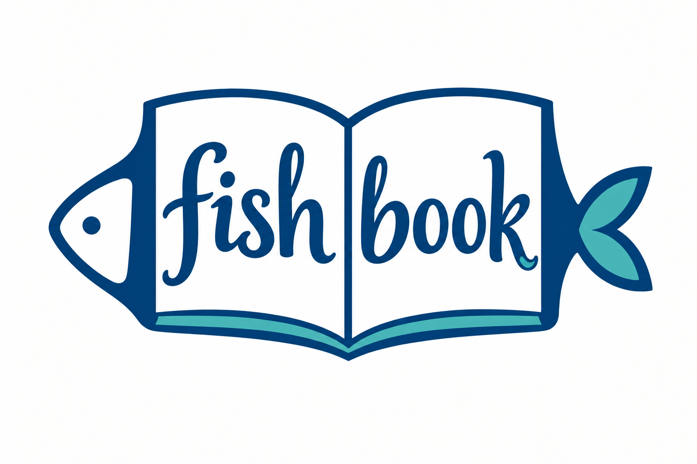

<p align="center">
  
</p>

<h1 align="center">Fishbook</h1>
<p align="center"><strong>把论文读明白。</strong></p>
<p align="center">在一个原生 macOS 工作区里，对照原文、阅读译稿、留下思考。</p>
<p align="center">A native macOS workspace for reading, annotating, and understanding papers.</p>
<p align="center">
  <a href="https://github.com/zzzfu411/Fishbook/releases/latest">下载</a> ·
  <a href="docs/usage.md">使用指南</a> ·
  <a href="docs/development.md">开发文档</a> ·
  <a href="https://github.com/zzzfu411/Fishbook/issues">反馈问题</a>
</p>

**macOS 14+ · Apple Silicon · SwiftUI / PDFKit · 本地存储**

## 能做什么

| 阅读过程 | Fishbook 提供的工具 |
| --- | --- |
| 对照着读 | 左侧 PDF，右侧讲解、译稿或个人记录；点材料中的页码回到原文 |
| 专心看原文 | 沉浸全屏、独立收起两侧栏、六种 PDF 配色，以及界面浅深色 |
| 找到关键位置 | 大纲搜索与折叠、页面缩略图、可命名书签、正文搜索和前后导航 |
| 顺着引文读 | 查看引用与被引路线图，逐篇展开、返回上一层，直接打开资料库中已有论文 |
| 边读边想 | 六色高亮、下划线、删除线、文字批注与疑问；支持搜索、编辑、撤销和重做 |
| 整理与回顾 | 待读列表、归档、跨论文待解疑问，以及“自己讲一遍”的费曼复述 |
| 带走阅读成果 | 导出带批注的 PDF 副本或 Markdown 记录；备份和恢复本地资料库 |

Fishbook 管理你导入的 PDF 与学习材料。讲解和译稿通过 Markdown、TXT 或讲解包添加，**目前不自动生成翻译，也不需要配置 AI API**。公开版本从空资料库开始，不附带论文合集。

## 开始使用

从 [Releases](https://github.com/zzzfu411/Fishbook/releases/latest) 下载 Apple Silicon 版本，解压后将 `Fishbook.app` 放入“应用程序”。当前发布包采用本机签名，尚未经过 Apple 公证；也可以从源码构建。

1. 拖入一份 PDF，或按 **⌘O** 导入。
2. 按 **⇧⌘O** 添加已有讲解或译稿，选择它对应的论文。
3. 选中文字做标记、记下疑问；按 **⇧⌘F** 进入沉浸阅读。
4. 按 **⇧⌘G** 查看引用路线图；首次查询需要联网，无需登录。

常用快捷键、材料格式与备份方法见[使用指南](docs/usage.md)。

## 从源码构建

需要 Apple Silicon Mac、macOS 14+ 和可用的 Xcode Command Line Tools（`swiftc`）。没有额外的 Swift 包依赖。

```sh
git clone https://github.com/zzzfu411/Fishbook.git
cd Fishbook
zsh build.sh
open build/Fishbook.app
```

运行检查需要 Node.js：

```sh
zsh tools/check.sh          # 存储、导入、材料修订与阅读器逻辑
zsh tools/check.sh --gui    # 另检查 PDFKit 与 WebKit；需要 macOS 图形会话
```

构建方式、源码结构与发布检查见[开发文档](docs/development.md)。

## 数据由你保管

论文、材料、批注和阅读进度保存在本机，默认目录为 `~/Library/Application Support/Fishbook/`。日常阅读无需登录或本地服务器；原 PDF 保持不变，批注可单独导出为副本。

引用路线图按需查询 OpenAlex，仅发送论文标题或标识符，不上传 PDF、笔记或整个资料库。引文收录可能不全，图中保留来源和获取时间；缓存最多 12 MiB，过期条目自动淘汰。

当前没有云同步、OCR、手绘、签名或页面重排。PDF 大纲取自原文件；原文件自带批注可查看和定位，暂不直接编辑。第三方组件及许可证见 [THIRD_PARTY_NOTICES.md](THIRD_PARTY_NOTICES.md)。

项目采用 [MIT 许可证](LICENSE)。

欢迎通过 [Issues](https://github.com/zzzfu411/Fishbook/issues) 提交问题和建议，代码贡献请先阅读 [CONTRIBUTING.md](CONTRIBUTING.md)。
